# JetFormBuilder - JetEngine Query Actions
Used to check if query has results / has no results and to get query items / count

Adds two actions:
1) Check Query Result
2) Get Values From Query

Also, adds a macro JFB Check Query - Form Field Value to get values from the form.

## Check Query Result
Checks if a certain query has / doesn't have results. \
If the switcher 'Throw error if query has results' is not enabled, and selected query has no values - the execution of the form will be interrupted.

Examples: 
1. Throw error if user has more than 3 products in the cart:
  - Create Posts Query based on Products post type:
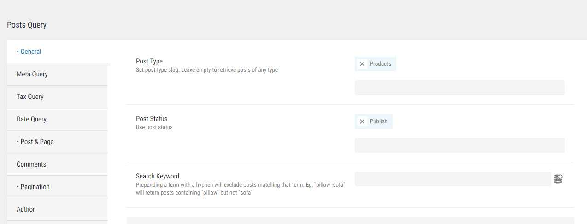
  - Set Post In to WC Products In Cart: 
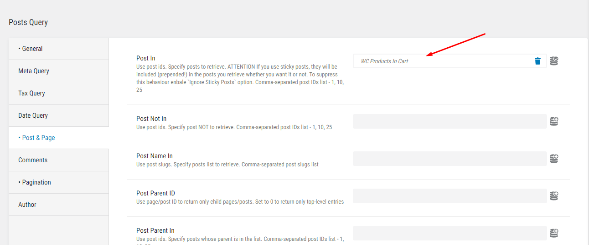
  - Set offset to 3 (so that the query will have no items if the user has 3 or less products in the cart)
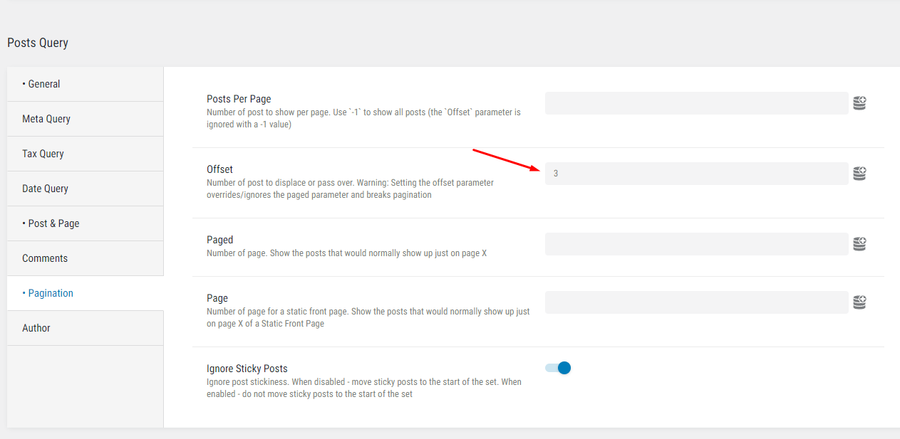
  - Set Check Query Results action to check the query you have created, and to throw an error if that query has items:
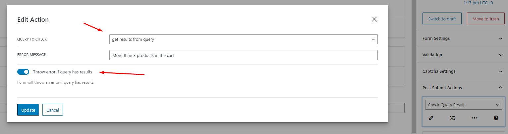

2. Throw error if the value, entered to a form field, is not a value from the current post field value. \
Suppose there is a meta field 'promo' in the post the form is on. \
We need to throw an error if that post has the value in it and the user entered a correct value.
  - Create Post Query for the post type the form is on (in our example, the form is on the page): \
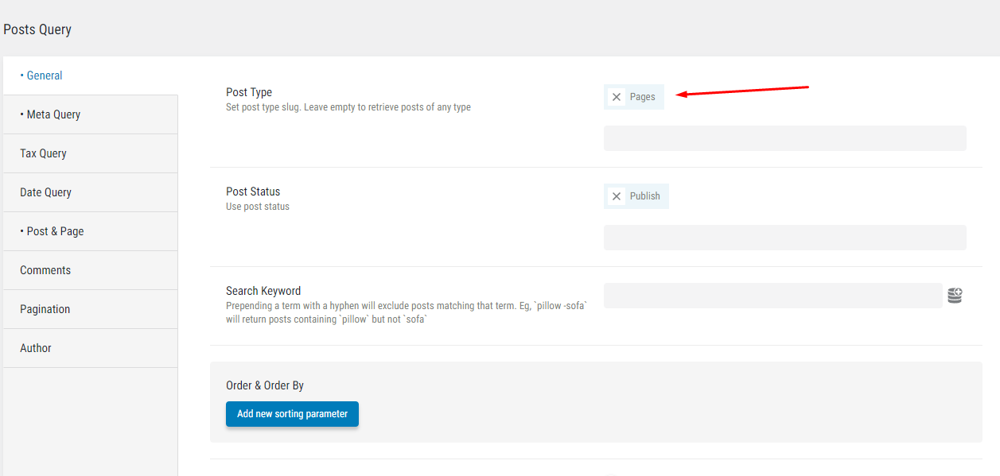
  - Set Meta Query
    - promo field Not exists (if there was never any promo code in the post, the form should accept any value)
    - promo field  Equals empty string (if there is no promo code in the post, the form should accept any value)
    - promo code Equals - macro JFB Check Query - Form Field Value - promo (if the value entered is not a value entered by user - the form should throw an error) \
    Here we set it so that, on form submit, 'promo' form field value will be taken to meta query

|  |  |
| --- | --- |
| 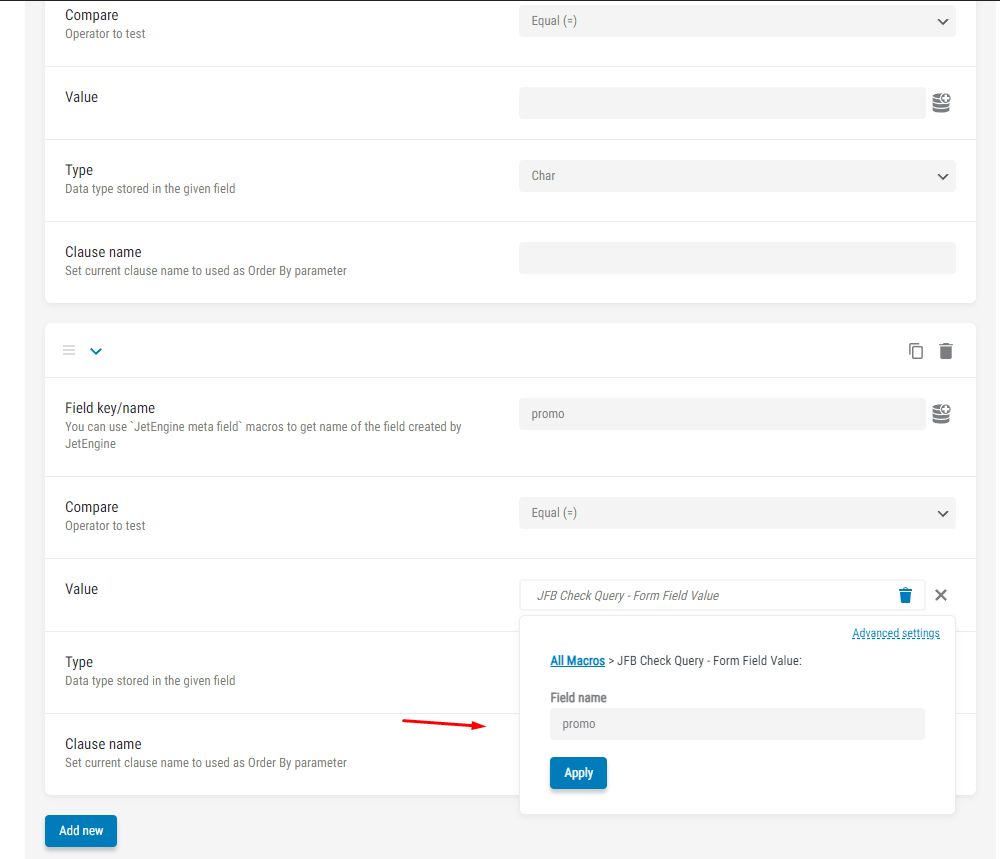 | 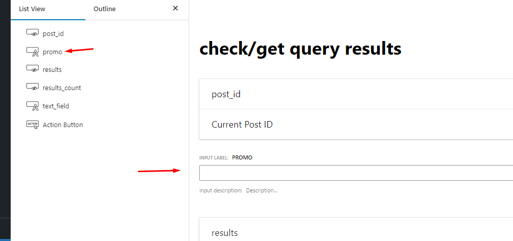 |

  - Set Post In to macro JFB Check Query - Form Field Value - post_id

|  |  |
| --- | --- |
| 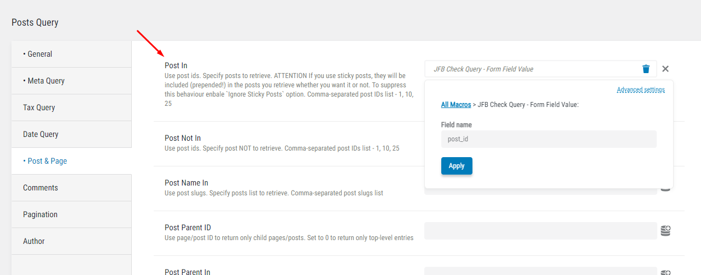 | 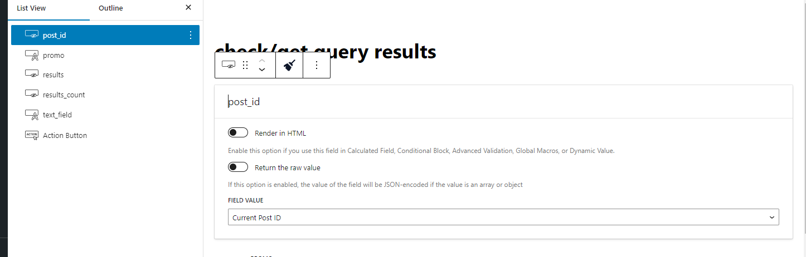 |

  - Set action \
  Note, that macros can be used to show form field result in the error message
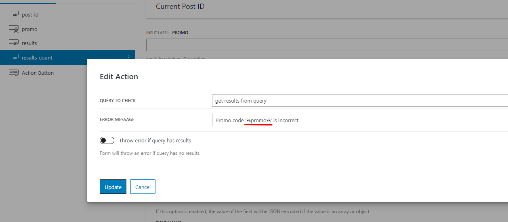

Now we have a post with 'Croco2024' promo code, let's see what happens if the user enters an invalid promo code:

|  |  |
| --- | --- |
|  | 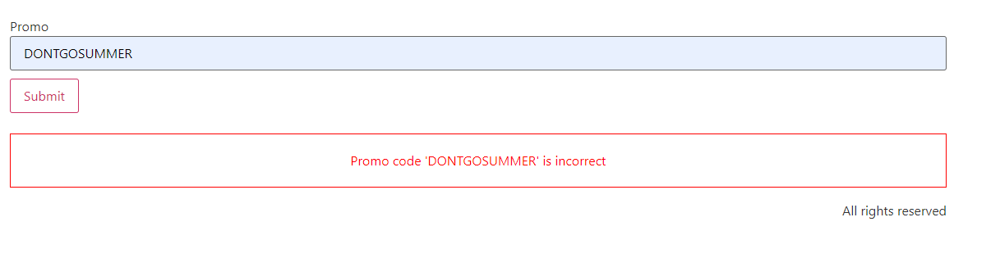 |
